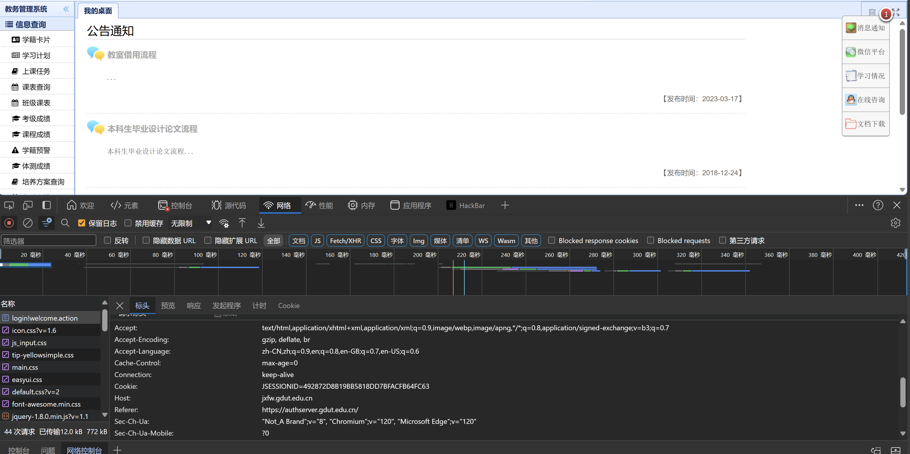

# 使用教程

## 获取cookies

浏览器登录教务系统，按下f12，进入“网络”模块，勾选“保留日志”，随后刷新网页。在左侧找到login!welcome.action，点击，在“标头”处找到cookie:JSESSIONID=xxxxxxxx，等号后的字符串即为你的cookie，每次重新登录都会刷新并且使上一次的作废，请保存并且不要注销账户。

## 获取课程id及名称

进入个人选课页面，右键，点击“审查元素”。随后按下shift+ctrl+C，鼠标点击你想选的课程的名称。在下面代码处找到kcrwdm和kcmc两项，分别是所选的课程id和名称（中文）。请保存。

## 修改源代码

将grab.py代码cookie改为你刚刚取到的cookie：

把main中的课程id及名称修改为你取到的id和名称：

随后保存修改。

## 运行代码

如果你还没有配置python环境，请前往python.org下载并安装python。随后到代码的存放目录，右键，点击在终端中打开，随后在终端中输入：

`python grab.py`

代码正常运行。
